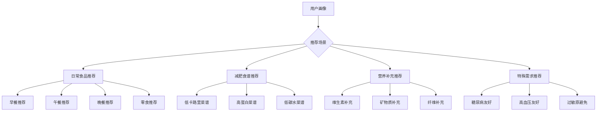
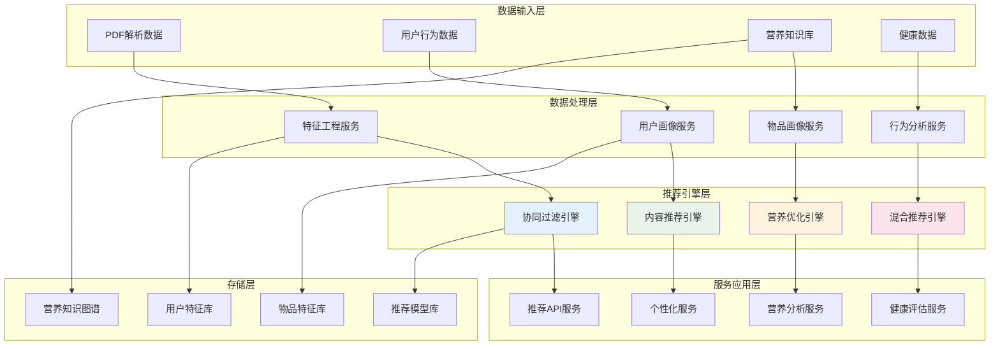
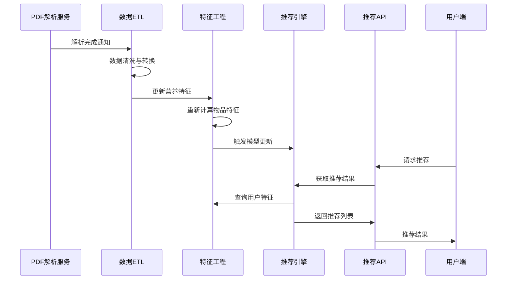
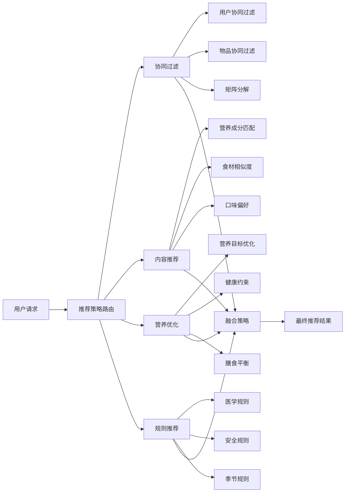
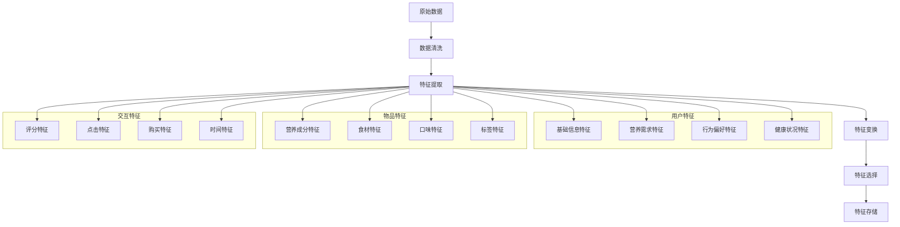
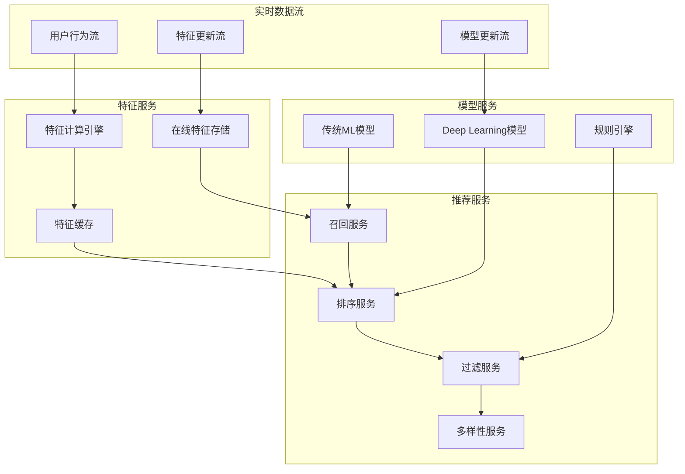
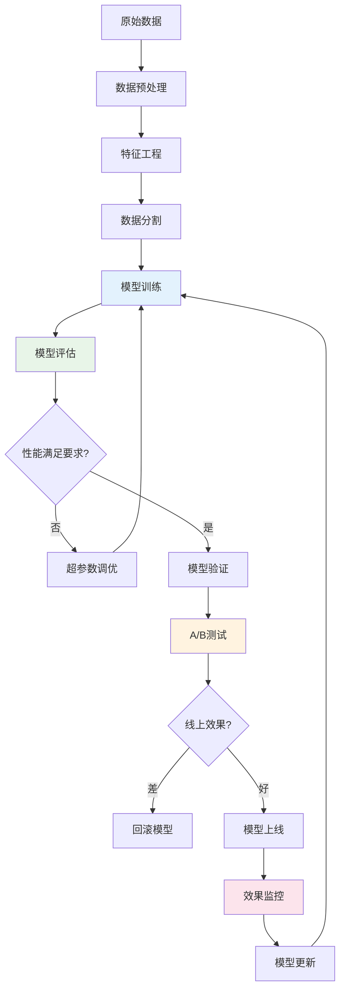
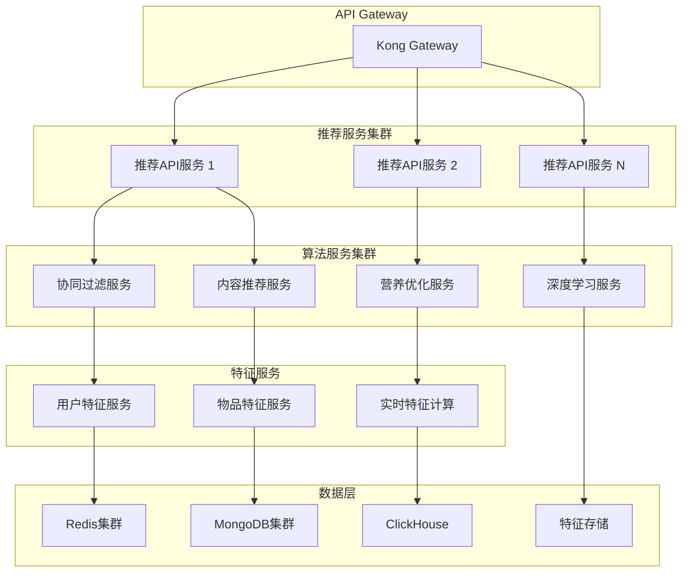

# 🔮 NutriGuide 营养推荐系统架构设计

## 📋 目录
- [1. 推荐系统概述](#1-推荐系统概述)
- [2. 系统架构设计](#2-系统架构设计)
- [3. 推荐算法策略](#3-推荐算法策略)
- [4. 数据流与特征工程](#4-数据流与特征工程)
- [5. 实时推荐引擎](#5-实时推荐引擎)
- [6. 模型训练与评估](#6-模型训练与评估)
- [7. API接口设计](#7-api接口设计)
- [8. 部署与扩展](#8-部署与扩展)

---

## 1. 推荐系统概述

### 1.1 业务目标
基于PDF解析的营养数据，为用户提供个性化的：
- **食品推荐**: 符合营养目标的食品选择
- **菜谱推荐**: 适合用户健康状况的食谱
- **膳食搭配**: 营养均衡的餐食组合
- **营养建议**: 基于缺失营养素的补充建议

### 1.2 推荐场景


### 1.3 核心挑战
- **营养复杂性**: 营养成分间的相互作用
- **个性化程度**: 用户健康状况差异巨大
- **实时性要求**: 用户状态实时变化
- **冷启动问题**: 新用户缺乏历史数据

---

## 2. 系统架构设计

### 2.1 整体架构图



### 2.2 与PDF解析服务集成



---

## 3. 推荐算法策略

### 3.1 多算法融合架构



### 3.2 核心算法详解

#### 3.2.1 营养优化推荐算法
```python
class NutritionOptimizedRecommender:
    """基于营养优化的推荐算法"""
    
    def __init__(self):
        self.nutrition_weights = {
            'calories': 0.3,
            'protein': 0.25,
            'carbs': 0.2,
            'fat': 0.15,
            'fiber': 0.1
        }
    
    def calculate_nutrition_score(self, user_profile, food_item):
        """计算营养匹配分数"""
        score = 0
        user_targets = user_profile['nutrition_targets']
        food_nutrition = food_item['nutrition']
        
        for nutrient, weight in self.nutrition_weights.items():
            target = user_targets.get(nutrient, 0)
            actual = food_nutrition.get(nutrient, 0)
            
            # 营养素匹配度计算
            match_score = self._calculate_nutrient_match(target, actual)
            score += weight * match_score
            
        return score
    
    def _calculate_nutrient_match(self, target, actual):
        """单个营养素匹配度"""
        if target == 0:
            return 0.5  # 中性分数
        
        ratio = actual / target
        if 0.8 <= ratio <= 1.2:  # 理想范围
            return 1.0
        elif 0.6 <= ratio <= 1.4:  # 可接受范围
            return 0.7
        else:
            return 0.3  # 不匹配
```

#### 3.2.2 健康约束推荐
```python
class HealthConstraintRecommender:
    """基于健康约束的推荐"""
    
    def filter_by_health_conditions(self, recommendations, user_health):
        """根据健康状况过滤推荐"""
        filtered_recs = []
        
        for rec in recommendations:
            if self._check_health_compatibility(rec, user_health):
                filtered_recs.append(rec)
                
        return filtered_recs
    
    def _check_health_compatibility(self, food_item, health_conditions):
        """检查食品与健康状况兼容性"""
        for condition in health_conditions:
            if condition == 'diabetes':
                if food_item['nutrition']['sugar'] > 10:  # 高糖
                    return False
            elif condition == 'hypertension':
                if food_item['nutrition']['sodium'] > 400:  # 高钠
                    return False
            elif condition == 'high_cholesterol':
                if food_item['nutrition']['saturated_fat'] > 5:
                    return False
                    
        return True
```

### 3.3 推荐策略配置
```yaml
recommendation_strategies:
  default:
    algorithms:
      - name: "collaborative_filtering"
        weight: 0.3
        config:
          method: "matrix_factorization"
          factors: 100
          regularization: 0.01
      
      - name: "content_based"
        weight: 0.25
        config:
          similarity_method: "cosine"
          features: ["nutrition", "ingredients", "tags"]
      
      - name: "nutrition_optimization"
        weight: 0.35
        config:
          optimization_goal: "balanced_nutrition"
          constraints: ["health_conditions", "allergies"]
      
      - name: "popularity_based"
        weight: 0.1
        config:
          time_decay: 0.95
          popularity_window: "30d"

  weight_loss:
    algorithms:
      - name: "nutrition_optimization"
        weight: 0.5
        config:
          optimization_goal: "calorie_deficit"
          max_calories_per_meal: 400
      
      - name: "content_based"
        weight: 0.3
        config:
          boost_tags: ["low_calorie", "high_protein", "high_fiber"]
      
      - name: "collaborative_filtering"
        weight: 0.2
```

---

## 4. 数据流与特征工程

### 4.1 特征工程管道



### 4.2 用户画像构建
```python
class UserProfileBuilder:
    """用户画像构建器"""
    
    def build_nutrition_profile(self, user_data):
        """构建营养画像"""
        profile = {
            'basic_info': self._extract_basic_info(user_data),
            'nutrition_targets': self._calculate_nutrition_targets(user_data),
            'dietary_preferences': self._extract_preferences(user_data),
            'health_constraints': self._extract_health_constraints(user_data),
            'behavior_patterns': self._analyze_behavior_patterns(user_data)
        }
        return profile
    
    def _calculate_nutrition_targets(self, user_data):
        """计算营养目标"""
        age = user_data['age']
        gender = user_data['gender']
        weight = user_data['weight']
        height = user_data['height']
        activity_level = user_data['activity_level']
        goal = user_data['health_goal']
        
        # 基础代谢率计算 (Mifflin-St Jeor方程)
        if gender == 'male':
            bmr = 10 * weight + 6.25 * height - 5 * age + 5
        else:
            bmr = 10 * weight + 6.25 * height - 5 * age - 161
        
        # 活动系数
        activity_multipliers = {
            'sedentary': 1.2,
            'lightly_active': 1.375,
            'moderately_active': 1.55,
            'very_active': 1.725
        }
        
        daily_calories = bmr * activity_multipliers.get(activity_level, 1.2)
        
        # 根据目标调整
        if goal == 'weight_loss':
            daily_calories *= 0.85  # 15%热量缺口
        elif goal == 'weight_gain':
            daily_calories *= 1.15  # 15%热量盈余
        
        return {
            'calories': daily_calories,
            'protein': weight * 1.2,  # 每公斤体重1.2g蛋白质
            'carbs': daily_calories * 0.45 / 4,  # 45%热量来自碳水
            'fat': daily_calories * 0.30 / 9,    # 30%热量来自脂肪
            'fiber': 25 + (daily_calories - 2000) / 1000 * 10  # 每1000卡路里额外10g纤维
        }
```

### 4.3 物品特征提取
```python
class FoodItemFeatureExtractor:
    """食品特征提取器"""
    
    def extract_nutrition_features(self, food_data):
        """提取营养特征"""
        nutrition = food_data['nutrition']
        
        features = {
            # 基础营养素
            'calories_per_100g': nutrition.get('calories', 0),
            'protein_per_100g': nutrition.get('protein', 0),
            'carbs_per_100g': nutrition.get('carbohydrates', 0),
            'fat_per_100g': nutrition.get('fat', 0),
            'fiber_per_100g': nutrition.get('fiber', 0),
            
            # 营养密度指标
            'protein_density': self._calculate_protein_density(nutrition),
            'nutrient_density': self._calculate_nutrient_density(nutrition),
            'calorie_density': nutrition.get('calories', 0) / 100,
            
            # 营养比例
            'protein_ratio': self._calculate_macro_ratio(nutrition, 'protein'),
            'carbs_ratio': self._calculate_macro_ratio(nutrition, 'carbohydrates'),
            'fat_ratio': self._calculate_macro_ratio(nutrition, 'fat'),
            
            # 健康指标
            'is_high_protein': nutrition.get('protein', 0) > 15,
            'is_low_calorie': nutrition.get('calories', 0) < 100,
            'is_high_fiber': nutrition.get('fiber', 0) > 5,
            'is_low_sodium': nutrition.get('sodium', 0) < 140
        }
        
        return features
    
    def _calculate_protein_density(self, nutrition):
        """计算蛋白质密度"""
        calories = nutrition.get('calories', 1)
        protein = nutrition.get('protein', 0)
        return (protein * 4) / calories if calories > 0 else 0
```

---

## 5. 实时推荐引擎

### 5.1 实时推荐架构



### 5.2 推荐服务实现
```python
class RealtimeRecommendationEngine:
    """实时推荐引擎"""
    
    def __init__(self):
        self.feature_store = FeatureStore()
        self.model_manager = ModelManager()
        self.recall_service = RecallService()
        self.ranking_service = RankingService()
        
    async def get_recommendations(self, user_id, context, num_recommendations=10):
        """获取实时推荐"""
        try:
            # 1. 获取用户特征
            user_features = await self.feature_store.get_user_features(user_id)
            
            # 2. 候选召回
            candidates = await self.recall_service.recall_candidates(
                user_features, context, num_candidates=100
            )
            
            # 3. 特征增强
            enhanced_candidates = await self._enhance_candidate_features(
                candidates, user_features, context
            )
            
            # 4. 模型预测与排序
            ranked_candidates = await self.ranking_service.rank_candidates(
                enhanced_candidates, user_features
            )
            
            # 5. 后处理过滤
            filtered_results = self._apply_business_rules(
                ranked_candidates, user_features
            )
            
            # 6. 多样性处理
            diversified_results = self._ensure_diversity(
                filtered_results, num_recommendations
            )
            
            return diversified_results
            
        except Exception as e:
            logger.error(f"推荐生成失败: {e}")
            return await self._get_fallback_recommendations(user_id, context)
    
    async def _enhance_candidate_features(self, candidates, user_features, context):
        """增强候选物品特征"""
        enhanced = []
        
        for candidate in candidates:
            # 获取物品特征
            item_features = await self.feature_store.get_item_features(
                candidate['item_id']
            )
            
            # 计算交互特征
            interaction_features = self._calculate_interaction_features(
                user_features, item_features, context
            )
            
            enhanced.append({
                'item_id': candidate['item_id'],
                'user_features': user_features,
                'item_features': item_features,
                'interaction_features': interaction_features,
                'context': context
            })
            
        return enhanced
```

### 5.3 营养约束优化
```python
class NutritionConstraintOptimizer:
    """营养约束优化器"""
    
    def optimize_meal_plan(self, user_profile, candidate_foods, meal_type):
        """优化餐食搭配"""
        from scipy.optimize import linear_sum_assignment
        import numpy as np
        
        # 用户营养目标
        targets = user_profile['nutrition_targets']
        meal_ratio = self._get_meal_ratio(meal_type)
        
        meal_targets = {
            nutrient: target * meal_ratio
            for nutrient, target in targets.items()
        }
        
        # 构建优化问题
        nutrition_matrix = self._build_nutrition_matrix(candidate_foods)
        cost_matrix = self._calculate_cost_matrix(
            nutrition_matrix, meal_targets, user_profile
        )
        
        # 求解最优组合
        row_indices, col_indices = linear_sum_assignment(cost_matrix)
        
        # 构建推荐结果
        recommendations = []
        for i, j in zip(row_indices, col_indices):
            if cost_matrix[i, j] < float('inf'):  # 可行解
                recommendations.append({
                    'food_id': candidate_foods[j]['id'],
                    'portion_size': self._calculate_optimal_portion(
                        candidate_foods[j], meal_targets
                    ),
                    'nutrition_contribution': nutrition_matrix[j],
                    'optimization_score': 1 / (1 + cost_matrix[i, j])
                })
        
        return recommendations
    
    def _calculate_cost_matrix(self, nutrition_matrix, targets, user_profile):
        """计算成本矩阵"""
        n_foods = len(nutrition_matrix)
        cost_matrix = np.zeros((n_foods, n_foods))
        
        for i in range(n_foods):
            for j in range(n_foods):
                nutrition = nutrition_matrix[j]
                
                # 营养偏差成本
                nutrition_cost = self._calculate_nutrition_deviation_cost(
                    nutrition, targets
                )
                
                # 健康约束成本
                health_cost = self._calculate_health_constraint_cost(
                    nutrition, user_profile['health_constraints']
                )
                
                # 偏好匹配成本
                preference_cost = self._calculate_preference_cost(
                    nutrition_matrix[j], user_profile['dietary_preferences']
                )
                
                cost_matrix[i, j] = nutrition_cost + health_cost + preference_cost
        
        return cost_matrix
```

---

## 6. 模型训练与评估

### 6.1 训练流水线



### 6.2 深度学习模型
```python
import tensorflow as tf
from tensorflow.keras import layers, models

class NutritionRecommendationModel:
    """营养推荐深度学习模型"""
    
    def __init__(self, config):
        self.config = config
        self.model = self._build_model()
    
    def _build_model(self):
        """构建模型架构"""
        # 用户特征输入
        user_input = layers.Input(shape=(self.config['user_feature_dim'],), name='user_features')
        user_embedding = layers.Dense(128, activation='relu')(user_input)
        user_dropout = layers.Dropout(0.2)(user_embedding)
        
        # 物品特征输入
        item_input = layers.Input(shape=(self.config['item_feature_dim'],), name='item_features')
        item_embedding = layers.Dense(128, activation='relu')(item_input)
        item_dropout = layers.Dropout(0.2)(item_embedding)
        
        # 营养特征输入
        nutrition_input = layers.Input(shape=(self.config['nutrition_feature_dim'],), name='nutrition_features')
        nutrition_embedding = layers.Dense(64, activation='relu')(nutrition_input)
        
        # 特征融合
        concat_features = layers.Concatenate()([
            user_dropout, item_dropout, nutrition_embedding
        ])
        
        # 深层网络
        hidden1 = layers.Dense(256, activation='relu')(concat_features)
        hidden1_dropout = layers.Dropout(0.3)(hidden1)
        
        hidden2 = layers.Dense(128, activation='relu')(hidden1_dropout)
        hidden2_dropout = layers.Dropout(0.2)(hidden2)
        
        hidden3 = layers.Dense(64, activation='relu')(hidden2_dropout)
        
        # 多任务输出
        preference_score = layers.Dense(1, activation='sigmoid', name='preference')(hidden3)
        nutrition_score = layers.Dense(1, activation='sigmoid', name='nutrition')(hidden3)
        health_score = layers.Dense(1, activation='sigmoid', name='health')(hidden3)
        
        # 最终评分
        final_score = layers.Average()([preference_score, nutrition_score, health_score])
        
        model = models.Model(
            inputs=[user_input, item_input, nutrition_input],
            outputs=[final_score, preference_score, nutrition_score, health_score]
        )
        
        return model
    
    def compile_model(self):
        """编译模型"""
        self.model.compile(
            optimizer=tf.keras.optimizers.Adam(learning_rate=0.001),
            loss={
                'average': 'binary_crossentropy',
                'preference': 'binary_crossentropy',
                'nutrition': 'mse',
                'health': 'binary_crossentropy'
            },
            loss_weights={
                'average': 1.0,
                'preference': 0.3,
                'nutrition': 0.4,
                'health': 0.3
            },
            metrics=['accuracy', 'mse']
        )
```

### 6.3 模型评估指标
```python
class RecommendationEvaluator:
    """推荐系统评估器"""
    
    def __init__(self):
        self.metrics = {}
    
    def evaluate_recommendations(self, predictions, ground_truth, user_profiles):
        """全面评估推荐效果"""
        
        # 1. 准确性指标
        accuracy_metrics = self._calculate_accuracy_metrics(predictions, ground_truth)
        
        # 2. 营养匹配度
        nutrition_metrics = self._calculate_nutrition_metrics(predictions, user_profiles)
        
        # 3. 多样性指标
        diversity_metrics = self._calculate_diversity_metrics(predictions)
        
        # 4. 覆盖率指标
        coverage_metrics = self._calculate_coverage_metrics(predictions)
        
        # 5. 健康指标
        health_metrics = self._calculate_health_metrics(predictions, user_profiles)
        
        return {
            'accuracy': accuracy_metrics,
            'nutrition': nutrition_metrics,
            'diversity': diversity_metrics,
            'coverage': coverage_metrics,
            'health': health_metrics
        }
    
    def _calculate_nutrition_metrics(self, predictions, user_profiles):
        """计算营养相关指标"""
        nutrition_scores = []
        
        for user_id, user_recs in predictions.items():
            user_profile = user_profiles[user_id]
            user_targets = user_profile['nutrition_targets']
            
            # 计算推荐食品的营养总和
            total_nutrition = self._sum_nutrition(user_recs)
            
            # 营养目标达成度
            target_achievement = self._calculate_target_achievement(
                total_nutrition, user_targets
            )
            
            # 营养均衡度
            balance_score = self._calculate_nutrition_balance(total_nutrition)
            
            nutrition_scores.append({
                'target_achievement': target_achievement,
                'balance_score': balance_score,
                'nutrition_diversity': self._calculate_nutrition_diversity(user_recs)
            })
        
        return {
            'avg_target_achievement': np.mean([s['target_achievement'] for s in nutrition_scores]),
            'avg_balance_score': np.mean([s['balance_score'] for s in nutrition_scores]),
            'avg_nutrition_diversity': np.mean([s['nutrition_diversity'] for s in nutrition_scores])
        }
```

---

## 7. API接口设计

### 7.1 推荐API规范

```yaml
# 个人推荐接口
POST /api/v1/recommendations/personal
parameters:
  - name: user_id
    type: string
    required: true
  - name: meal_type
    type: string
    enum: [breakfast, lunch, dinner, snack]
  - name: num_recommendations
    type: integer
    default: 10
  - name: context
    type: object
    properties:
      location: string
      time: string
      budget_range: string

response:
  success:
    code: 200
    data:
      recommendations: []
      explanation: string
      nutrition_summary: object
      confidence_score: number

# 营养分析接口
POST /api/v1/nutrition/analyze
parameters:
  - name: food_items
    type: array
    required: true
  - name: user_profile
    type: object

response:
  success:
    code: 200
    data:
      nutrition_summary: object
      recommendations: object
      deficiencies: array
      excess: array
```

### 7.2 推荐解释API
```python
class RecommendationExplainer:
    """推荐解释服务"""
    
    def generate_explanation(self, user_id, recommendations):
        """生成推荐解释"""
        explanations = []
        
        for rec in recommendations:
            explanation = {
                'item_id': rec['item_id'],
                'score': rec['score'],
                'reasons': self._generate_reasons(user_id, rec),
                'nutrition_benefits': self._explain_nutrition_benefits(user_id, rec),
                'health_impact': self._explain_health_impact(user_id, rec)
            }
            explanations.append(explanation)
        
        return {
            'explanations': explanations,
            'overall_strategy': self._explain_overall_strategy(user_id, recommendations)
        }
    
    def _generate_reasons(self, user_id, recommendation):
        """生成推荐理由"""
        reasons = []
        
        # 营养匹配理由
        if recommendation['nutrition_score'] > 0.8:
            reasons.append("营养成分符合您的健康目标")
        
        # 偏好匹配理由
        if recommendation['preference_score'] > 0.7:
            reasons.append("根据您的口味偏好推荐")
        
        # 健康约束理由
        if recommendation['health_score'] > 0.9:
            reasons.append("适合您的健康状况")
        
        # 协同过滤理由
        if 'similar_users' in recommendation:
            reasons.append("具有相似健康目标的用户也喜欢这个")
        
        return reasons
```

---

## 8. 部署与扩展

### 8.1 微服务部署架构



### 8.2 性能优化策略

```yaml
performance_optimization:
  caching_strategy:
    user_features:
      cache_type: "Redis"
      ttl: "1h"
      prefetch: true
    
    item_features:
      cache_type: "Redis"
      ttl: "24h"
      warm_up: true
    
    model_predictions:
      cache_type: "Redis"
      ttl: "30m"
      cache_key_strategy: "user_id+context_hash"
  
  model_serving:
    batch_prediction: true
    model_warming: true
    gpu_acceleration: true
    quantization: "int8"
  
  database_optimization:
    connection_pooling: true
    read_replicas: 3
    query_optimization: true
    index_strategy: "covering_indexes"
```

### 8.3 扩展性考虑

```python
class ScalableRecommendationSystem:
    """可扩展推荐系统"""
    
    def __init__(self):
        self.load_balancer = LoadBalancer()
        self.model_manager = ModelManager()
        self.feature_store = DistributedFeatureStore()
    
    async def handle_high_traffic(self, request_volume):
        """处理高流量"""
        if request_volume > self.config['scale_threshold']:
            # 自动扩容
            await self.auto_scale_services()
            
            # 启用降级策略
            self.enable_fallback_strategies()
            
            # 预热缓存
            await self.warm_up_cache()
    
    def enable_fallback_strategies(self):
        """启用降级策略"""
        strategies = [
            'use_cached_recommendations',
            'reduce_candidate_size',
            'use_simple_algorithms',
            'return_popular_items'
        ]
        
        for strategy in strategies:
            self.config[f'fallback_{strategy}'] = True
```

---

## 📊 总结与建议

### 核心优势
1. **智能化**: 多算法融合，营养优化
2. **个性化**: 深度用户画像，精准推荐
3. **实时性**: 在线学习，实时更新
4. **可解释**: 推荐理由清晰，用户信任度高
5. **健康导向**: 以营养健康为核心目标

### 技术亮点
- 营养约束优化算法
- 多任务深度学习模型
- 实时特征工程
- 智能降级策略

### 实施路径
1. **Phase 1**: 基础推荐功能
2. **Phase 2**: 营养优化引擎
3. **Phase 3**: 深度学习模型
4. **Phase 4**: 实时个性化

这套推荐系统将PDF解析的营养数据转化为个性化的健康建议，为用户提供科学、精准的营养指导服务。 