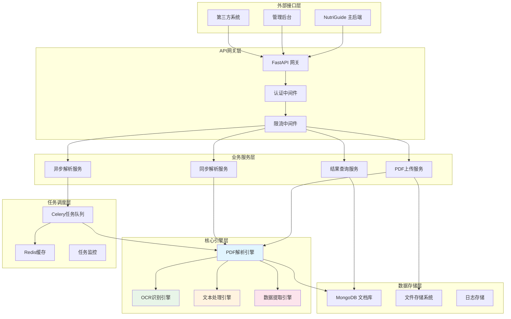
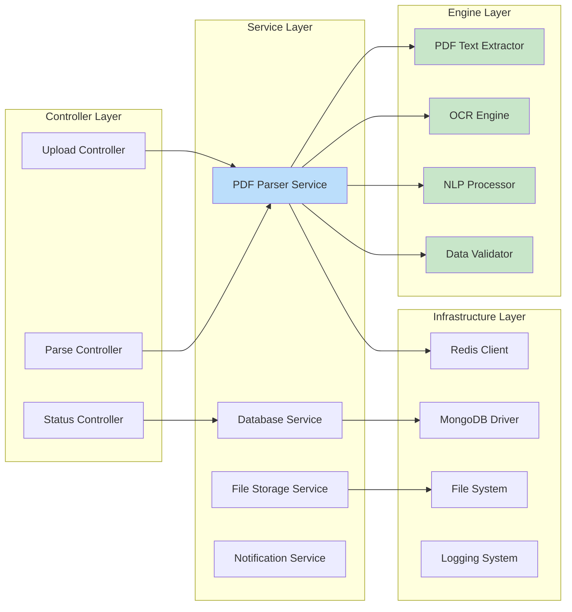
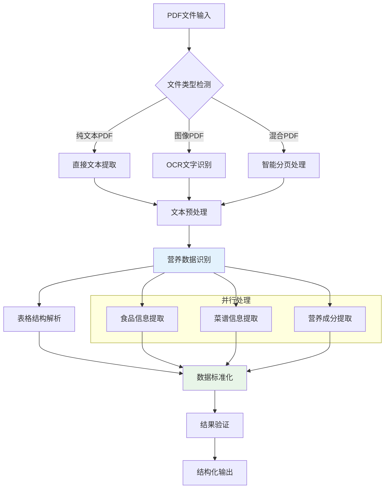
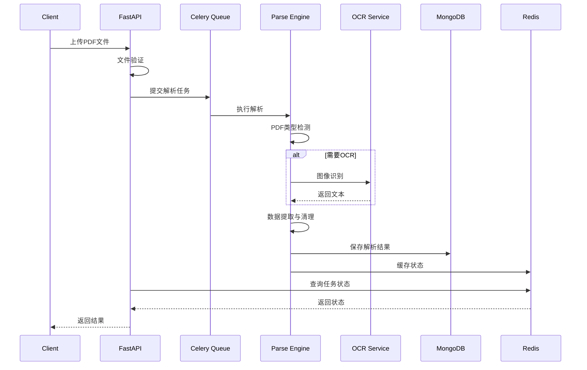
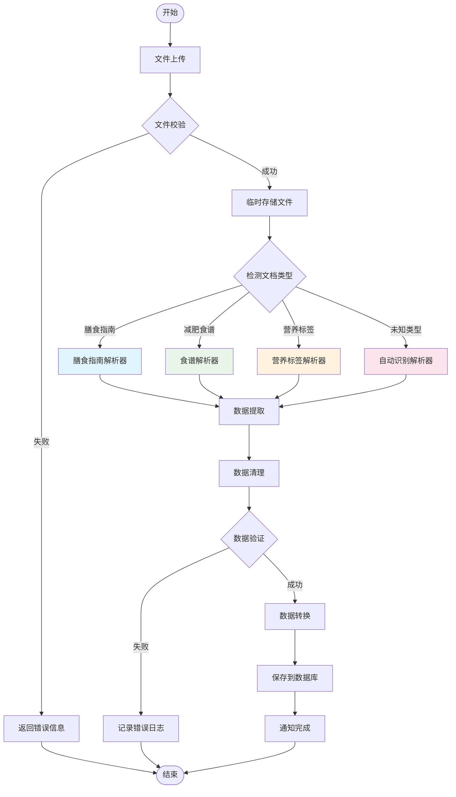
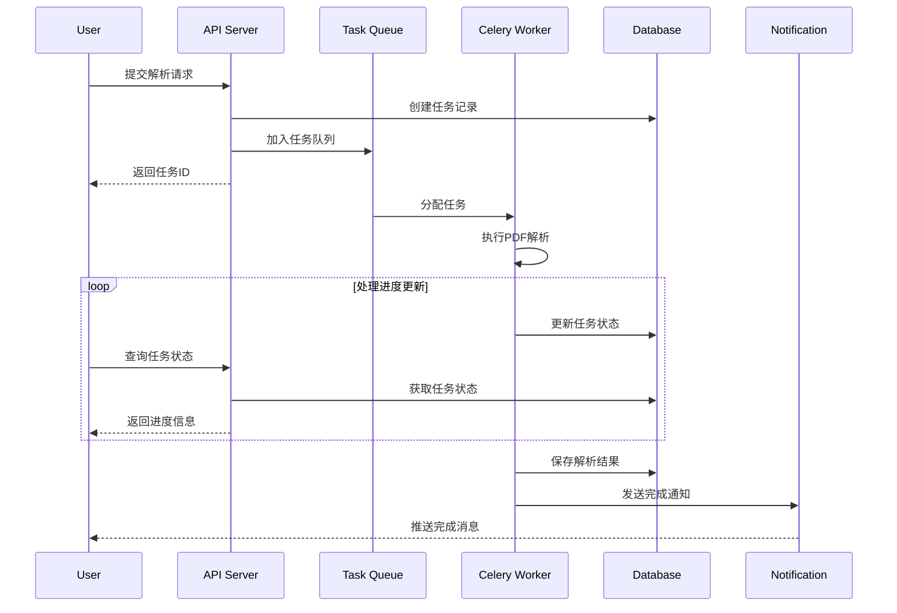
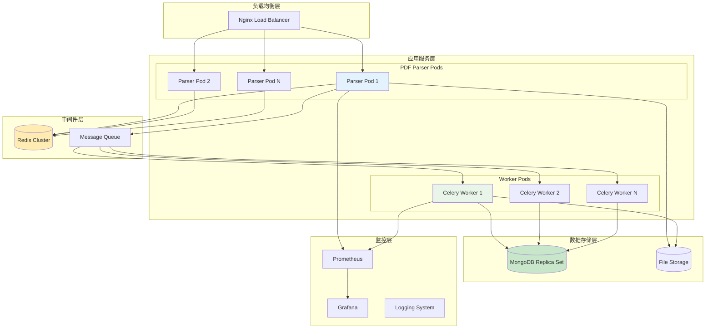
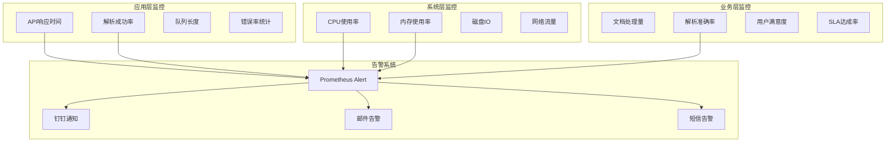
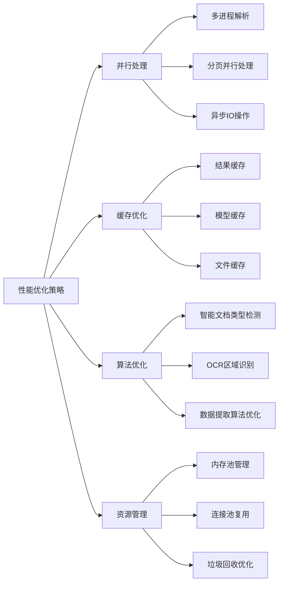
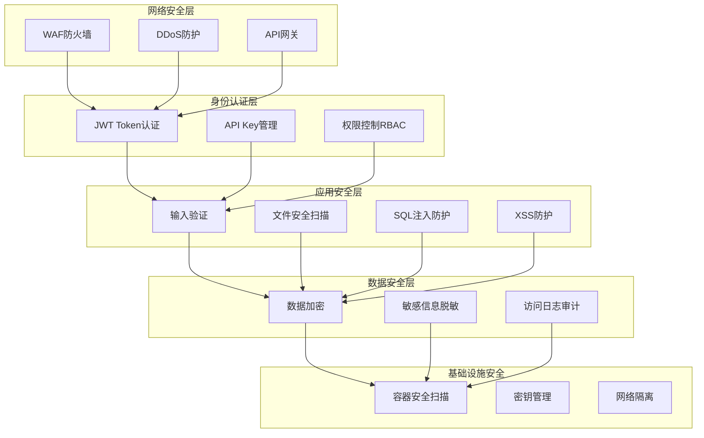

# 🏗️ NutriGuide PDF 解析服务架构技术规范

## 📋 目录
- [1. 项目概述](#1-项目概述)
- [2. 系统架构设计](#2-系统架构设计)
- [3. 技术选型与架构决策](#3-技术选型与架构决策)
- [4. 核心服务模块](#4-核心服务模块)
- [5. 数据流程与处理](#5-数据流程与处理)
- [6. 部署架构](#6-部署架构)
- [7. 监控与运维](#7-监控与运维)
- [8. API 接口规范](#8-api-接口规范)
- [9. 性能与扩展性](#9-性能与扩展性)
- [10. 安全与合规](#10-安全与合规)

---

## 1. 项目概述

### 1.1 业务背景
NutriGuide PDF 解析服务是为营养指导平台构建的专用微服务，主要负责解析各国膳食指南、减肥食谱等PDF文档，提取结构化的营养数据供主后端系统使用。

### 1.2 核心目标
- **智能解析**: 支持中美膳食指南、减肥食谱等多类型PDF文档
- **高度准确**: 通过AI+OCR技术确保营养数据提取准确性
- **高并发处理**: 支持批量文档并发解析
- **标准化输出**: 按照团队数据字段规范输出结构化数据
- **可扩展性**: 支持新文档类型快速接入

### 1.3 技术挑战
- 多语言PDF文档处理（中英文混合）
- 复杂表格结构识别
- 非标准格式营养标签解析
- 大文件并发处理性能优化

---

## 2. 系统架构设计

### 2.1 整体架构图



### 2.2 服务分层架构



---

## 3. 技术选型与架构决策

### 3.1 核心技术栈

| 技术层面 | 选择方案 | 理由 |
|---------|---------|------|
| **Web框架** | FastAPI | 高性能异步框架，自动API文档生成 |
| **编程语言** | Python 3.11+ | 丰富的PDF处理生态，AI库支持好 |
| **PDF解析** | pdfplumber + PyPDF2 | 互补方案，处理不同类型PDF |
| **OCR引擎** | Tesseract + PaddleOCR | 中英文混合识别，准确率高 |
| **任务队列** | Celery + Redis | 成熟的异步任务处理方案 |
| **数据库** | MongoDB | 文档型数据库，适合非结构化数据 |
| **缓存** | Redis | 高性能缓存，支持任务状态管理 |
| **容器化** | Docker + K8s | 便于部署和扩容 |

### 3.2 架构设计原则

#### 3.2.1 微服务原则
- **单一职责**: 专注PDF解析与数据提取
- **服务自治**: 独立部署、独立扩容
- **接口标准**: RESTful API + 标准HTTP状态码
- **数据隔离**: 独立的数据库实例

#### 3.2.2 高可用原则
- **无状态设计**: 服务实例可任意扩容
- **优雅降级**: OCR失败时使用基础文本提取
- **熔断机制**: 防止级联故障
- **健康检查**: 实时监控服务状态

#### 3.2.3 性能优先
- **异步处理**: 大文件异步队列处理
- **并发控制**: 合理的工作线程数配置
- **缓存策略**: 解析结果智能缓存
- **资源优化**: 内存使用监控与清理

---

## 4. 核心服务模块

### 4.1 PDF解析引擎架构



### 4.2 数据处理流水线



### 4.3 模块详细设计

#### 4.3.1 PDF解析器模块
```python
class PDFParserService:
    """PDF解析核心服务"""
    
    async def parse_pdf(self, file_path: str, parse_type: str) -> dict:
        """
        主解析入口
        Args:
            file_path: PDF文件路径
            parse_type: 解析类型 (food/recipe/auto)
        Returns:
            解析结果字典
        """
        
    def _detect_pdf_type(self, file_path: str) -> str:
        """检测PDF类型"""
        
    def _extract_text_content(self, file_path: str) -> List[str]:
        """提取文本内容"""
        
    def _extract_tables(self, file_path: str) -> List[dict]:
        """提取表格数据"""
        
    def _ocr_process(self, image_path: str) -> str:
        """OCR图像识别"""
```

#### 4.3.2 数据提取器模块
```python
class DataExtractorService:
    """营养数据提取服务"""
    
    def extract_food_data(self, text: str) -> dict:
        """提取食品营养数据"""
        
    def extract_recipe_data(self, text: str) -> dict:
        """提取菜谱数据"""
        
    def standardize_nutrition_units(self, data: dict) -> dict:
        """营养单位标准化"""
        
    def validate_nutrition_values(self, data: dict) -> bool:
        """营养数值验证"""
```

---

## 5. 数据流程与处理

### 5.1 文档解析流程



### 5.2 异步任务处理流程



### 5.3 数据标准化处理

#### 5.3.1 营养数据标准化
```json
{
  "standardization_rules": {
    "units": {
      "energy": ["kcal", "kJ", "卡路里", "千焦"],
      "weight": ["g", "mg", "μg", "克", "毫克", "微克"],
      "percentage": ["%", "percent", "百分比"]
    },
    "conversion": {
      "kJ_to_kcal": 0.239,
      "mg_to_g": 0.001,
      "μg_to_mg": 0.001
    },
    "validation": {
      "calories_range": [0, 900],
      "protein_range": [0, 100],
      "fat_range": [0, 100],
      "carbs_range": [0, 100]
    }
  }
}
```

#### 5.3.2 数据映射规则
```json
{
  "field_mapping": {
    "chinese_terms": {
      "热量": "calories",
      "蛋白质": "protein", 
      "脂肪": "fat",
      "碳水化合物": "carbohydrates",
      "膳食纤维": "fiber",
      "钠": "sodium"
    },
    "english_terms": {
      "energy": "calories",
      "protein": "protein",
      "total fat": "fat",
      "carbohydrate": "carbohydrates",
      "dietary fiber": "fiber",
      "sodium": "sodium"
    }
  }
}
```

---

## 6. 部署架构

### 6.1 容器化部署架构



### 6.2 Kubernetes部署配置

#### 6.2.1 服务部署配置
```yaml
# pdf-parser-deployment.yaml
apiVersion: apps/v1
kind: Deployment
metadata:
  name: pdf-parser-service
spec:
  replicas: 3
  selector:
    matchLabels:
      app: pdf-parser
  template:
    metadata:
      labels:
        app: pdf-parser
    spec:
      containers:
      - name: pdf-parser
        image: nutriguide/pdf-parser:latest
        ports:
        - containerPort: 8000
        env:
        - name: ENVIRONMENT
          value: "production"
        - name: MONGODB_URL
          valueFrom:
            secretKeyRef:
              name: db-secret
              key: mongodb-url
        - name: REDIS_URL
          valueFrom:
            secretKeyRef:
              name: cache-secret
              key: redis-url
        resources:
          requests:
            memory: "512Mi"
            cpu: "250m"
          limits:
            memory: "1Gi"
            cpu: "500m"
        livenessProbe:
          httpGet:
            path: /health
            port: 8000
          initialDelaySeconds: 30
          periodSeconds: 10
        readinessProbe:
          httpGet:
            path: /health
            port: 8000
          initialDelaySeconds: 5
          periodSeconds: 5
```

#### 6.2.2 Celery Worker部署配置
```yaml
# celery-worker-deployment.yaml
apiVersion: apps/v1
kind: Deployment
metadata:
  name: celery-worker
spec:
  replicas: 5
  selector:
    matchLabels:
      app: celery-worker
  template:
    metadata:
      labels:
        app: celery-worker
    spec:
      containers:
      - name: celery-worker
        image: nutriguide/pdf-parser:latest
        command: ["celery"]
        args: ["-A", "main.celery", "worker", "--loglevel=info", "--concurrency=4"]
        env:
        - name: ENVIRONMENT
          value: "production"
        resources:
          requests:
            memory: "1Gi"
            cpu: "500m"
          limits:
            memory: "2Gi"
            cpu: "1000m"
```

---

## 7. 监控与运维

### 7.1 监控体系架构



### 7.2 关键监控指标

#### 7.2.1 性能指标
```yaml
performance_metrics:
  api_metrics:
    - response_time_p95: "<2s"
    - response_time_p99: "<5s"
    - throughput: ">100 requests/min"
    - error_rate: "<1%"
  
  parsing_metrics:
    - parsing_success_rate: ">95%"
    - avg_parsing_time: "<30s"
    - queue_waiting_time: "<60s"
    - concurrent_tasks: "监控队列长度"
  
  resource_metrics:
    - cpu_usage: "<80%"
    - memory_usage: "<85%"
    - disk_usage: "<75%"
    - network_io: "监控带宽使用"
```

#### 7.2.2 业务指标
```yaml
business_metrics:
  document_metrics:
    - daily_processed_docs: "每日处理文档数"
    - document_type_distribution: "文档类型分布"
    - parsing_accuracy_by_type: "各类型解析准确率"
  
  data_quality_metrics:
    - extraction_completeness: "数据提取完整度"
    - validation_pass_rate: "数据验证通过率"
    - manual_review_rate: "人工审核率"
```

### 7.3 日志管理策略

#### 7.3.1 日志分级
```python
# 日志级别定义
LOG_LEVELS = {
    "DEBUG": "开发调试信息",
    "INFO": "正常业务信息",
    "WARNING": "警告信息(需关注)",
    "ERROR": "错误信息(需处理)",
    "CRITICAL": "严重错误(立即处理)"
}

# 关键业务日志
BUSINESS_LOGS = {
    "parsing_start": "解析任务开始",
    "parsing_success": "解析任务成功",
    "parsing_failed": "解析任务失败",
    "data_validation_failed": "数据验证失败",
    "ocr_fallback": "OCR降级处理"
}
```

#### 7.3.2 日志聚合分析
```yaml
log_analysis:
  error_pattern_detection:
    - "OCR识别失败模式分析"
    - "PDF格式兼容性问题"
    - "内存溢出模式识别"
  
  performance_analysis:
    - "慢查询分析"
    - "解析时间分布分析"  
    - "资源使用模式分析"
  
  business_insights:
    - "用户行为分析"
    - "文档类型趋势分析"
    - "解析准确率趋势"
```

---

## 8. API 接口规范

### 8.1 RESTful API设计

#### 8.1.1 接口概览
```
POST   /api/v1/parse/sync          # 同步解析
POST   /api/v1/parse/async         # 异步解析
GET    /api/v1/parse/status/{id}   # 查询状态
GET    /api/v1/parse/result/{id}   # 获取结果
GET    /api/v1/parse/history       # 解析历史
DELETE /api/v1/parse/{id}          # 删除记录
GET    /api/v1/health              # 健康检查
```

#### 8.1.2 请求响应规范
```json
// 标准响应格式
{
  "code": 200,
  "message": "success",
  "data": { },
  "timestamp": "2024-01-01T12:00:00Z",
  "request_id": "uuid-string"
}

// 错误响应格式
{
  "code": 400,
  "message": "参数错误",
  "error": {
    "type": "ValidationError",
    "details": "文件格式不支持"
  },
  "timestamp": "2024-01-01T12:00:00Z",
  "request_id": "uuid-string"
}
```

### 8.2 主要接口详细设计

#### 8.2.1 同步解析接口
```yaml
# POST /api/v1/parse/sync
parameters:
  - name: file
    type: file
    required: true
    description: PDF文件
  - name: parsing_type
    type: string
    enum: [auto, food, recipe, guide]
    default: auto
    description: 解析类型
  - name: language
    type: string
    enum: [zh, en, auto]
    default: auto
    description: 文档语言

response:
  success:
    code: 200
    data:
      document_id: string
      parsing_type: string
      extracted_data:
        foods: []
        recipes: []
        nutrition_facts: []
      metadata:
        pages_count: integer
        processing_time: number
        confidence_score: number

  error:
    code: 400/413/500
    message: string
```

#### 8.2.2 异步解析接口
```yaml
# POST /api/v1/parse/async
parameters:
  - name: file
    type: file
    required: true
  - name: callback_url
    type: string
    description: 完成后回调URL
  - name: priority
    type: string
    enum: [low, normal, high]
    default: normal

response:
  success:
    code: 202
    data:
      task_id: string
      document_id: string
      status: "queued"
      estimated_time: number
```

#### 8.2.3 状态查询接口
```yaml
# GET /api/v1/parse/status/{document_id}
response:
  success:
    code: 200
    data:
      document_id: string
      status: string  # pending/processing/completed/failed
      progress: number  # 0-100
      current_step: string
      estimated_remaining_time: number
      created_at: datetime
      updated_at: datetime
```

### 8.3 Webhook回调规范

#### 8.3.1 解析完成回调
```json
// POST {callback_url}
{
  "event": "parsing_completed",
  "document_id": "doc-12345",
  "status": "completed",
  "data": {
    "foods": [],
    "recipes": [],
    "nutrition_facts": []
  },
  "metadata": {
    "processing_time": 45.2,
    "confidence_score": 0.95,
    "pages_processed": 10
  },
  "timestamp": "2024-01-01T12:00:00Z"
}
```

#### 8.3.2 解析失败回调
```json
{
  "event": "parsing_failed", 
  "document_id": "doc-12345",
  "status": "failed",
  "error": {
    "code": "OCR_FAILED",
    "message": "图像质量过低，无法识别",
    "details": {}
  },
  "timestamp": "2024-01-01T12:00:00Z"
}
```

---

## 9. 性能与扩展性

### 9.1 性能优化策略

#### 9.1.1 解析性能优化


#### 9.1.2 系统性能基准
```yaml
performance_benchmarks:
  small_files:  # < 1MB
    sync_processing: "<5s"
    throughput: "50 files/min"
    memory_usage: "<100MB per file"
  
  medium_files:  # 1-10MB  
    async_processing: "<30s"
    throughput: "20 files/min"
    memory_usage: "<500MB per file"
  
  large_files:  # > 10MB
    async_processing: "<120s"
    throughput: "5 files/min"
    memory_usage: "<1GB per file"
  
  concurrent_processing:
    max_concurrent_tasks: 50
    queue_capacity: 1000
    response_time_p95: "<2s"
```

### 9.2 扩展性设计

#### 9.2.1 水平扩展架构
```yaml
scaling_strategy:
  api_layer:
    auto_scaling:
      min_replicas: 2
      max_replicas: 10
      cpu_threshold: 70%
      memory_threshold: 80%
  
  worker_layer:
    auto_scaling:
      min_replicas: 3
      max_replicas: 20
      queue_length_threshold: 100
      processing_time_threshold: 300s
  
  storage_layer:
    mongodb:
      sharding_strategy: "range_based"
      replica_set: 3
    redis:
      cluster_mode: true
      nodes: 6
```

#### 9.2.2 新文档类型扩展
```python
# 插件化解析器架构
class DocumentParserPlugin:
    """文档解析插件基类"""
    
    def can_handle(self, document_type: str) -> bool:
        """判断是否能处理该文档类型"""
        pass
    
    def parse(self, file_path: str) -> dict:
        """解析文档"""
        pass
    
    def validate_result(self, result: dict) -> bool:
        """验证解析结果"""
        pass

# 注册新解析器
@register_parser("nutrition_label_cn")
class ChineseNutritionLabelParser(DocumentParserPlugin):
    """中国营养标签解析器"""
    pass

@register_parser("diet_guide_us") 
class USDietaryGuidelineParser(DocumentParserPlugin):
    """美国膳食指南解析器"""
    pass
```

### 9.3 容量规划

#### 9.3.1 资源需求估算
```yaml
capacity_planning:
  daily_processing_target: 10000  # 每日处理文档数
  peak_hour_multiplier: 3         # 峰值倍数
  
  resource_requirements:
    api_servers:
      cpu_per_instance: "2 cores"
      memory_per_instance: "4GB"
      estimated_instances: 5
    
    worker_servers:
      cpu_per_instance: "4 cores" 
      memory_per_instance: "8GB"
      estimated_instances: 15
    
    storage:
      mongodb_storage: "1TB"
      file_storage: "5TB"
      redis_memory: "16GB"
```

#### 9.3.2 成本优化建议
```yaml
cost_optimization:
  compute_optimization:
    - "使用Spot实例处理非关键任务"
    - "按需扩缩容策略"
    - "资源池复用"
  
  storage_optimization:
    - "冷热数据分离存储"
    - "压缩算法优化"
    - "过期数据自动清理"
  
  network_optimization:
    - "CDN加速文件下载"
    - "数据压缩传输"
    - "区域就近部署"
```

---

## 10. 安全与合规

### 10.1 安全架构设计



### 10.2 数据安全策略

#### 10.2.1 文件安全检查
```python
# 文件安全验证流程
class FileSecurityValidator:
    """文件安全验证器"""
    
    def validate_file(self, file_path: str) -> SecurityResult:
        """文件安全验证"""
        checks = [
            self._check_file_type(),
            self._check_file_size(),
            self._check_virus_scan(),
            self._check_malicious_content(),
            self._check_embedded_scripts()
        ]
        return self._aggregate_results(checks)
        
    def _check_virus_scan(self, file_path: str) -> bool:
        """病毒扫描检查"""
        pass
        
    def _check_malicious_content(self, file_path: str) -> bool:
        """恶意内容检查"""
        pass
```

#### 10.2.2 数据脱敏策略
```yaml
data_masking_rules:
  sensitive_fields:
    - field: "user_info.phone"
      method: "partial_mask"
      pattern: "***-****-{last4}"
    
    - field: "document.source_url"
      method: "domain_mask"
      pattern: "*****.{domain}"
    
    - field: "api_key"
      method: "full_mask"
      replacement: "***MASKED***"

  log_filtering:
    - "过滤请求中的敏感参数"
    - "响应数据脱敏处理"
    - "错误信息敏感信息清理"
```

### 10.3 合规性要求

#### 10.3.1 数据保护合规
```yaml
compliance_requirements:
  data_protection:
    - "用户数据加密存储"
    - "数据传输HTTPS加密"
    - "敏感数据访问控制"
    - "数据删除权保障"
  
  audit_requirements:
    - "操作日志完整记录"
    - "数据访问审计追踪"
    - "权限变更记录"
    - "安全事件响应机制"
  
  retention_policy:
    - "解析结果保留90天"
    - "日志数据保留1年"
    - "用户数据按需删除"
    - "备份数据定期清理"
```

#### 10.3.2 API安全规范
```yaml
api_security_standards:
  authentication:
    - method: "JWT + API Key"
    - token_expiry: "2小时"
    - refresh_token_expiry: "7天"
    - multi_factor_auth: "可选启用"
  
  rate_limiting:
    - anonymous: "10 requests/min"
    - authenticated: "100 requests/min"
    - premium: "1000 requests/min"
  
  input_validation:
    - "严格参数类型检查"
    - "文件大小限制"
    - "文件类型白名单"
    - "SQL注入防护"
```

---

## 📊 总结与建议

### 架构优势
1. **高可扩展性**: 微服务架构支持按需扩容
2. **高可用性**: 多层冗余设计，故障自动恢复
3. **高性能**: 异步处理+缓存优化，支持高并发
4. **标准化**: 统一的API接口和数据格式规范
5. **安全可靠**: 全方位安全防护和合规保障

### 技术选型理由
1. **FastAPI**: 现代化Python Web框架，性能优异
2. **Celery**: 成熟的分布式任务队列方案
3. **MongoDB**: 适合存储半结构化的解析结果
4. **Docker+K8s**: 标准化容器部署，便于运维

### 实施建议
1. **分阶段实施**: 先实现核心解析功能，再逐步完善
2. **性能测试**: 在生产部署前进行充分的压力测试
3. **监控完善**: 建立完整的监控告警体系
4. **文档维护**: 保持技术文档和API文档的及时更新

### 后续发展方向
1. **AI增强**: 集成大语言模型提升解析准确率
2. **多模态支持**: 支持更多文档格式（Word、Excel等）
3. **智能推荐**: 基于解析结果提供营养建议
4. **国际化**: 支持更多国家的膳食指南标准

---

> 📝 **备注**: 本架构设计基于当前项目需求和技术栈制定，随着业务发展可能需要适时调整和优化。建议定期评审架构合理性，确保系统能够持续满足业务需求。 