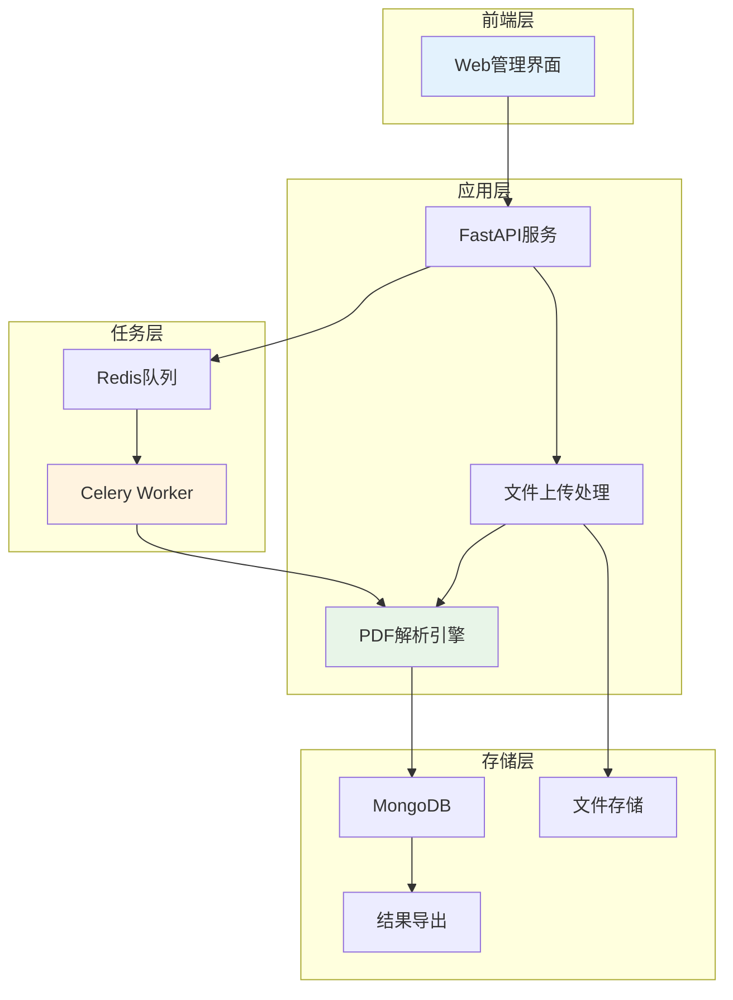
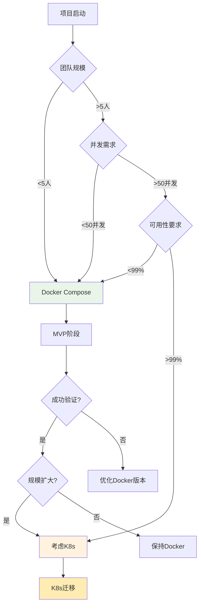

# 📋 NutriGuide PDF解析服务 MVP版本规划

## 🎯 MVP目标定位

### 核心目标
- **内部工具**: 专为开发团队设计的数据处理工具
- **数据采集**: 批量处理PDF文档，构建营养数据集
- **快速验证**: 验证PDF解析算法的可行性
- **数据准备**: 为后续推荐系统提供训练数据

### 用户场景


---

## 🏗️ MVP架构设计

### 简化架构图


### 核心功能模块

#### 1. Web管理界面
```html
<!-- 简单的上传界面 -->
<!DOCTYPE html>
<html>
<head>
    <title>PDF解析工具 - 内部版</title>
    <link href="https://cdn.jsdelivr.net/npm/bootstrap@5.1.3/dist/css/bootstrap.min.css" rel="stylesheet">
</head>
<body>
    <div class="container mt-5">
        <h2>营养PDF解析工具</h2>
        
        <!-- 文件上传区域 -->
        <div class="row mt-4">
            <div class="col-md-8">
                <div class="card">
                    <div class="card-header">
                        <h5>批量上传PDF文件</h5>
                    </div>
                    <div class="card-body">
                        <form id="uploadForm" enctype="multipart/form-data">
                            <div class="mb-3">
                                <label for="files" class="form-label">选择PDF文件</label>
                                <input type="file" class="form-control" id="files" name="files" 
                                       multiple accept=".pdf" required>
                            </div>
                            
                            <div class="mb-3">
                                <label for="parseType" class="form-label">解析类型</label>
                                <select class="form-select" id="parseType" name="parseType">
                                    <option value="auto">自动识别</option>
                                    <option value="nutrition_label">营养标签</option>
                                    <option value="recipe">食谱</option>
                                    <option value="diet_guide">膳食指南</option>
                                </select>
                            </div>
                            
                            <div class="mb-3">
                                <label for="description" class="form-label">批次描述</label>
                                <textarea class="form-control" id="description" name="description" 
                                         rows="2" placeholder="描述本次上传的文件类型和来源..."></textarea>
                            </div>
                            
                            <button type="submit" class="btn btn-primary">开始解析</button>
                        </form>
                    </div>
                </div>
            </div>
            
            <!-- 任务状态面板 -->
            <div class="col-md-4">
                <div class="card">
                    <div class="card-header">
                        <h5>解析任务状态</h5>
                    </div>
                    <div class="card-body">
                        <div id="taskStatus">
                            <!-- 动态更新任务状态 -->
                        </div>
                    </div>
                </div>
            </div>
        </div>
        
        <!-- 历史记录 -->
        <div class="row mt-4">
            <div class="col-12">
                <div class="card">
                    <div class="card-header d-flex justify-content-between align-items-center">
                        <h5>解析历史</h5>
                        <button class="btn btn-success btn-sm" onclick="exportAll()">
                            导出全部数据
                        </button>
                    </div>
                    <div class="card-body">
                        <table class="table table-striped">
                            <thead>
                                <tr>
                                    <th>批次ID</th>
                                    <th>文件数量</th>
                                    <th>解析类型</th>
                                    <th>状态</th>
                                    <th>成功率</th>
                                    <th>创建时间</th>
                                    <th>操作</th>
                                </tr>
                            </thead>
                            <tbody id="historyTable">
                                <!-- 动态加载历史记录 -->
                            </tbody>
                        </table>
                    </div>
                </div>
            </div>
        </div>
    </div>
    
    <script src="https://cdn.jsdelivr.net/npm/bootstrap@5.1.3/dist/js/bootstrap.bundle.min.js"></script>
    <script src="/static/js/app.js"></script>
</body>
</html>
```

#### 2. 核心API设计
```python
# main.py - 简化版
from fastapi import FastAPI, UploadFile, File, Form, BackgroundTasks
from fastapi.staticfiles import StaticFiles
from fastapi.templating import Jinja2Templates
from typing import List
import uuid
from datetime import datetime

app = FastAPI(title="PDF解析工具 - MVP版")

# 静态文件和模板
app.mount("/static", StaticFiles(directory="static"), name="static")
templates = Jinja2Templates(directory="templates")

@app.get("/")
async def dashboard(request: Request):
    """主页面"""
    return templates.TemplateResponse("index.html", {"request": request})

@app.post("/api/v1/parse/batch")
async def batch_parse(
    background_tasks: BackgroundTasks,
    files: List[UploadFile] = File(...),
    parse_type: str = Form("auto"),
    description: str = Form("")
):
    """批量解析接口"""
    batch_id = str(uuid.uuid4())
    
    # 创建批次记录
    batch_info = {
        "batch_id": batch_id,
        "file_count": len(files),
        "parse_type": parse_type,
        "description": description,
        "status": "queued",
        "created_at": datetime.utcnow(),
        "files": []
    }
    
    # 保存文件并创建解析任务
    for file in files:
        file_id = str(uuid.uuid4())
        file_path = f"uploads/{batch_id}/{file.filename}"
        
        # 保存文件
        await save_file(file, file_path)
        
        # 添加到批次信息
        batch_info["files"].append({
            "file_id": file_id,
            "filename": file.filename,
            "file_path": file_path,
            "status": "pending"
        })
        
        # 提交解析任务
        background_tasks.add_task(process_pdf_file, file_id, file_path, parse_type)
    
    # 保存批次信息到数据库
    await db.save_batch(batch_info)
    
    return {
        "batch_id": batch_id,
        "message": f"已提交 {len(files)} 个文件进行解析",
        "status": "queued"
    }

@app.get("/api/v1/batches")
async def get_batches():
    """获取所有批次"""
    batches = await db.get_all_batches()
    return {"batches": batches}

@app.get("/api/v1/batches/{batch_id}")
async def get_batch_detail(batch_id: str):
    """获取批次详情"""
    batch = await db.get_batch(batch_id)
    if not batch:
        raise HTTPException(status_code=404, detail="批次不存在")
    return batch

@app.get("/api/v1/export/{batch_id}")
async def export_batch_data(batch_id: str):
    """导出批次数据"""
    data = await db.get_batch_results(batch_id)
    
    # 转换为CSV格式
    csv_content = convert_to_csv(data)
    
    return StreamingResponse(
        io.StringIO(csv_content),
        media_type="text/csv",
        headers={"Content-Disposition": f"attachment; filename=batch_{batch_id}.csv"}
    )

@app.get("/api/v1/export/all")
async def export_all_data():
    """导出所有数据"""
    all_data = await db.get_all_results()
    
    # 按类型分组导出
    export_package = create_export_package(all_data)
    
    return StreamingResponse(
        export_package,
        media_type="application/zip",
        headers={"Content-Disposition": "attachment; filename=nutriguide_dataset.zip"}
    )
```

#### 3. 简化的解析引擎
```python
# parser.py - MVP版本
class SimplePDFParser:
    """简化PDF解析器"""
    
    def __init__(self):
        self.extractors = {
            'nutrition_label': NutritionLabelExtractor(),
            'recipe': RecipeExtractor(),
            'diet_guide': DietGuideExtractor(),
            'auto': AutoDetectExtractor()
        }
    
    async def parse_file(self, file_path: str, parse_type: str) -> dict:
        """解析单个文件"""
        try:
            # 1. 基础信息提取
            basic_info = self._extract_basic_info(file_path)
            
            # 2. 选择解析器
            extractor = self.extractors.get(parse_type, self.extractors['auto'])
            
            # 3. 内容提取
            extracted_data = await extractor.extract(file_path)
            
            # 4. 数据标准化
            standardized_data = self._standardize_data(extracted_data)
            
            # 5. 质量评估
            quality_score = self._assess_quality(standardized_data)
            
            result = {
                "file_info": basic_info,
                "extracted_data": standardized_data,
                "quality_score": quality_score,
                "parse_type": parse_type,
                "status": "completed"
            }
            
            return result
            
        except Exception as e:
            return {
                "file_info": {"filename": file_path},
                "error": str(e),
                "status": "failed"
            }
    
    def _extract_basic_info(self, file_path: str) -> dict:
        """提取基础信息"""
        return {
            "filename": os.path.basename(file_path),
            "file_size": os.path.getsize(file_path),
            "pages": self._get_page_count(file_path),
            "processed_at": datetime.utcnow().isoformat()
        }
    
    def _standardize_data(self, data: dict) -> dict:
        """数据标准化"""
        # 按照团队数据字段对照表进行标准化
        if data.get('type') == 'food':
            return self._standardize_food_data(data)
        elif data.get('type') == 'recipe':
            return self._standardize_recipe_data(data)
        else:
            return data

class NutritionLabelExtractor:
    """营养标签提取器"""
    
    async def extract(self, file_path: str) -> dict:
        """提取营养标签信息"""
        # 1. PDF文本提取
        text = self._extract_text(file_path)
        
        # 2. 营养成分识别
        nutrition_data = self._extract_nutrition_facts(text)
        
        # 3. 食品信息识别
        food_info = self._extract_food_info(text)
        
        return {
            "type": "food",
            "food_info": food_info,
            "nutrition": nutrition_data,
            "raw_text": text
        }
    
    def _extract_nutrition_facts(self, text: str) -> dict:
        """提取营养成分"""
        import re
        
        patterns = {
            'calories': r'热量[：:]\s*(\d+(?:\.\d+)?)\s*(?:kcal|千卡|大卡)',
            'protein': r'蛋白质[：:]\s*(\d+(?:\.\d+)?)\s*g',
            'fat': r'脂肪[：:]\s*(\d+(?:\.\d+)?)\s*g',
            'carbohydrates': r'碳水化合物[：:]\s*(\d+(?:\.\d+)?)\s*g',
            'sodium': r'钠[：:]\s*(\d+(?:\.\d+)?)\s*mg'
        }
        
        nutrition = {}
        for nutrient, pattern in patterns.items():
            match = re.search(pattern, text)
            if match:
                nutrition[nutrient] = float(match.group(1))
        
        return nutrition
```

---

## 📅 里程碑计划

### Phase 1: 基础框架 (Week 1-2)
**目标**: 搭建基本的上传和解析框架

**开发任务**:
```yaml
Week 1:
  - 项目环境搭建
    - FastAPI项目初始化
    - Docker开发环境配置
    - 基础依赖安装
  - 文件上传功能
    - 多文件上传接口
    - 文件存储管理
    - 基础验证逻辑

Week 2:
  - Web界面开发
    - 简单的上传界面
    - 任务状态显示
    - 基础样式和交互
  - 数据库设计
    - MongoDB集合设计
    - 基础数据模型
    - 简单的CRUD操作
```

**交付物**:
- ✅ 可运行的上传界面
- ✅ 文件存储功能
- ✅ 基础数据库操作

### Phase 2: 核心解析 (Week 3-4)
**目标**: 实现基础的PDF解析功能

**开发任务**:
```yaml
Week 3:
  - PDF解析引擎
    - pdfplumber集成
    - 文本提取功能
    - 基础OCR支持
  - 营养标签解析器
    - 正则表达式匹配
    - 营养成分提取
    - 数据验证逻辑

Week 4:
  - 异步任务处理
    - Celery Worker配置
    - Redis队列管理
    - 任务状态追踪
  - 结果存储
    - 解析结果保存
    - 错误处理机制
    - 日志记录
```

**交付物**:
- ✅ 基础PDF文本提取
- ✅ 营养标签解析器
- ✅ 异步任务处理

### Phase 3: 数据标准化 (Week 5-6)
**目标**: 完善数据提取和标准化

**开发任务**:
```yaml
Week 5:
  - 数据标准化
    - 营养单位转换
    - 字段映射规则
    - 数据质量评估
  - 多类型支持
    - 食谱解析器
    - 膳食指南解析器
    - 自动类型识别

Week 6:
  - 质量控制
    - 数据验证规则
    - 异常检测
    - 人工审核标记
  - 导出功能
    - CSV导出
    - JSON导出
    - 批量下载
```

**交付物**:
- ✅ 数据标准化模块
- ✅ 多类型解析支持
- ✅ 数据导出功能

### Phase 4: 优化完善 (Week 7-8)
**目标**: 性能优化和功能完善

**开发任务**:
```yaml
Week 7:
  - 性能优化
    - 并发处理优化
    - 内存使用优化
    - 解析速度提升
  - 监控日志
    - 解析成功率统计
    - 性能指标监控
    - 错误日志分析

Week 8:
  - 用户体验
    - 界面优化
    - 进度提示改进
    - 错误信息友好化
  - 文档完善
    - 使用说明文档
    - API接口文档
    - 部署指南
```

**交付物**:
- ✅ 性能优化版本
- ✅ 完整的监控系统
- ✅ 用户使用文档

---

## 🐳 Docker vs K8s 部署策略

### 当前Docker架构 vs K8s架构

#### Docker单机部署 (MVP推荐)
```yaml
# docker-compose.yml - MVP版本
version: '3.8'
services:
  web:
    build: .
    ports:
      - "8000:8000"
    environment:
      - ENVIRONMENT=development
      - MONGODB_URL=mongodb://mongo:27017/nutriguide
      - REDIS_URL=redis://redis:6379/0
    volumes:
      - ./uploads:/app/uploads
      - ./logs:/app/logs
    depends_on:
      - mongo
      - redis

  worker:
    build: .
    command: celery -A main.celery worker --loglevel=info --concurrency=2
    environment:
      - ENVIRONMENT=development
      - MONGODB_URL=mongodb://mongo:27017/nutriguide
      - REDIS_URL=redis://redis:6379/0
    volumes:
      - ./uploads:/app/uploads
      - ./logs:/app/logs
    depends_on:
      - mongo
      - redis

  mongo:
    image: mongo:5.0
    ports:
      - "27017:27017"
    volumes:
      - mongo_data:/data/db

  redis:
    image: redis:7-alpine
    ports:
      - "6379:6379"

volumes:
  mongo_data:
```

#### K8s vs Docker 对比

| 维度 | Docker Compose | Kubernetes |
|------|----------------|------------|
| **适用场景** | 单机开发、小规模部署 | 生产环境、集群管理 |
| **复杂度** | 简单，配置文件少 | 复杂，多个配置文件 |
| **扩展性** | 手动扩容，单机限制 | 自动扩容，多机支持 |
| **高可用** | 单点故障风险 | 多副本，故障转移 |
| **管理成本** | 低，易于维护 | 高，需要专业运维 |
| **资源利用** | 中等 | 高，动态调度 |

### 部署策略建议

#### 阶段1: MVP开发阶段 (推荐Docker)
```bash
# 快速启动开发环境
git clone <repository>
cd pdf_parser
cp .env.example .env
docker-compose up -d

# 查看服务状态
docker-compose ps

# 查看日志
docker-compose logs -f web

# 停止服务
docker-compose down
```

**优势**:
- ✅ 快速搭建开发环境
- ✅ 团队开发环境一致性
- ✅ 简单的一键部署
- ✅ 资源需求低
- ✅ 易于调试和开发

#### 阶段2: 生产就绪阶段 (考虑K8s)
```yaml
# 何时考虑迁移到K8s
migration_triggers:
  performance:
    - 并发用户 > 100
    - 日处理文档 > 1000
    - 需要水平扩容
  
  reliability:
    - 需要99.9%可用性
    - 零停机部署需求
    - 多环境管理
  
  scale:
    - 多团队使用
    - 微服务架构
    - 复杂的部署需求
```

### Docker到K8s渐进式迁移

#### 步骤1: Docker优化
```yaml
# 优化后的docker-compose.yml
version: '3.8'
services:
  web:
    image: nutriguide/pdf-parser:${VERSION}
    deploy:
      replicas: 2
      resources:
        limits:
          memory: 512M
          cpus: '0.5'
    healthcheck:
      test: ["CMD", "curl", "-f", "http://localhost:8000/health"]
      interval: 30s
      timeout: 10s
      retries: 3
```

#### 步骤2: K8s准备
```yaml
# kubernetes/deployment.yaml
apiVersion: apps/v1
kind: Deployment
metadata:
  name: pdf-parser
spec:
  replicas: 2
  selector:
    matchLabels:
      app: pdf-parser
  template:
    metadata:
      labels:
        app: pdf-parser
    spec:
      containers:
      - name: pdf-parser
        image: nutriguide/pdf-parser:latest
        ports:
        - containerPort: 8000
        resources:
          requests:
            memory: "256Mi"
            cpu: "250m"
          limits:
            memory: "512Mi"
            cpu: "500m"
        livenessProbe:
          httpGet:
            path: /health
            port: 8000
          initialDelaySeconds: 30
          periodSeconds: 10
```

### 部署决策流程图



---

## 📊 MVP成功指标

### 技术指标
```yaml
performance_targets:
  processing_speed:
    - 小文件(<1MB): <10秒
    - 中文件(1-5MB): <30秒
    - 大文件(>5MB): <60秒
  
  success_rate:
    - 营养标签解析: >80%
    - 文本提取: >95%
    - 系统稳定性: >99%
  
  capacity:
    - 并发处理: 5个文件
    - 日处理量: 100个文件
    - 存储容量: 10GB
```

### 业务指标
```yaml
business_targets:
  data_quality:
    - 有效数据提取率: >70%
    - 标准化成功率: >90%
    - 人工审核通过率: >80%
  
  user_adoption:
    - 团队使用率: >80%
    - 平均处理批次: 10批次/周
    - 数据复用率: >50%
```

## 🎯 总结

**MVP版本特点**:
1. **简单够用**: 专注核心功能，避免过度设计
2. **快速迭代**: 2个月完成基础版本
3. **成本可控**: Docker单机部署，维护简单
4. **扩展友好**: 为后续K8s迁移留下接口

**推荐的技术栈**:
- **开发阶段**: Docker Compose
- **生产阶段**: 根据实际规模决定是否迁移K8s
- **数据存储**: MongoDB + Redis
- **文件处理**: 本地存储 + 定期备份

这个MVP版本能够快速验证PDF解析的技术可行性，为团队提供实用的数据处理工具，并为后续的推荐系统建设奠定数据基础。 